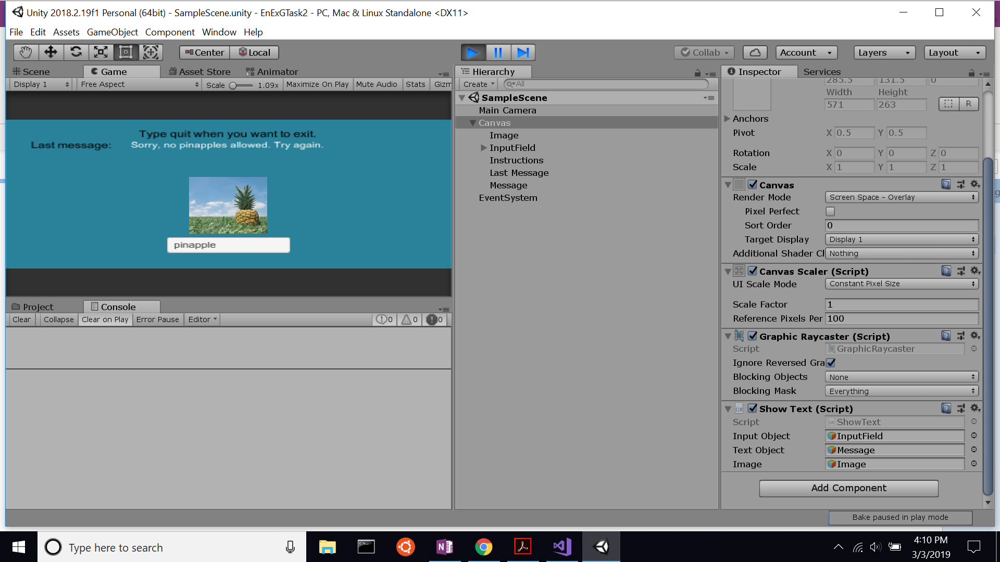
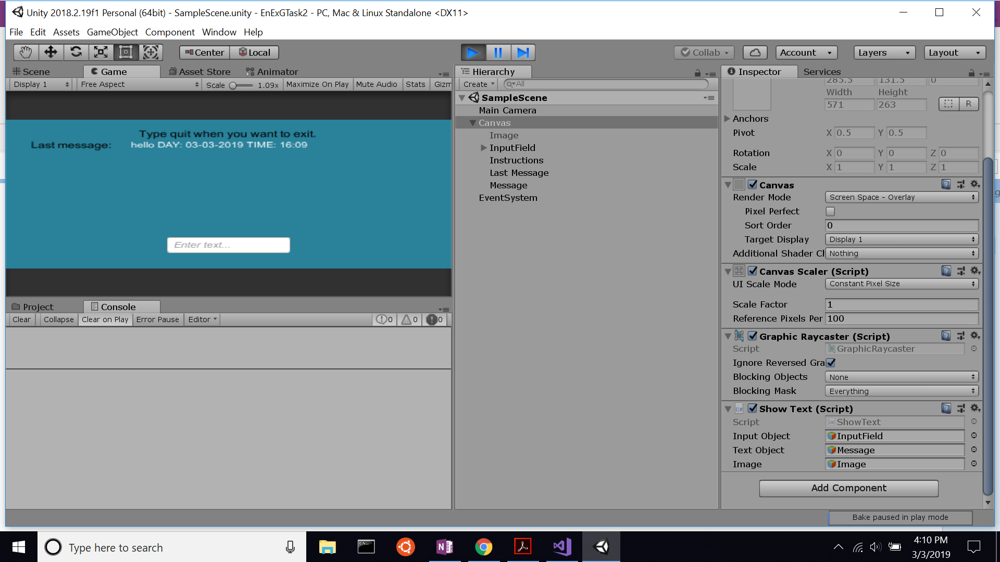

# EnExGTask2

Task 2 for App Development Internship application.

**Main script located at: EnExGTask2/Assets/Scripts/ShowText.cs**

Made using Unity 2018.2.19f1 (64-bit). If you have unity, you can clone this repository, open the project, and play. 

Startup:

Usage:

Prohibited word:

Restart:

